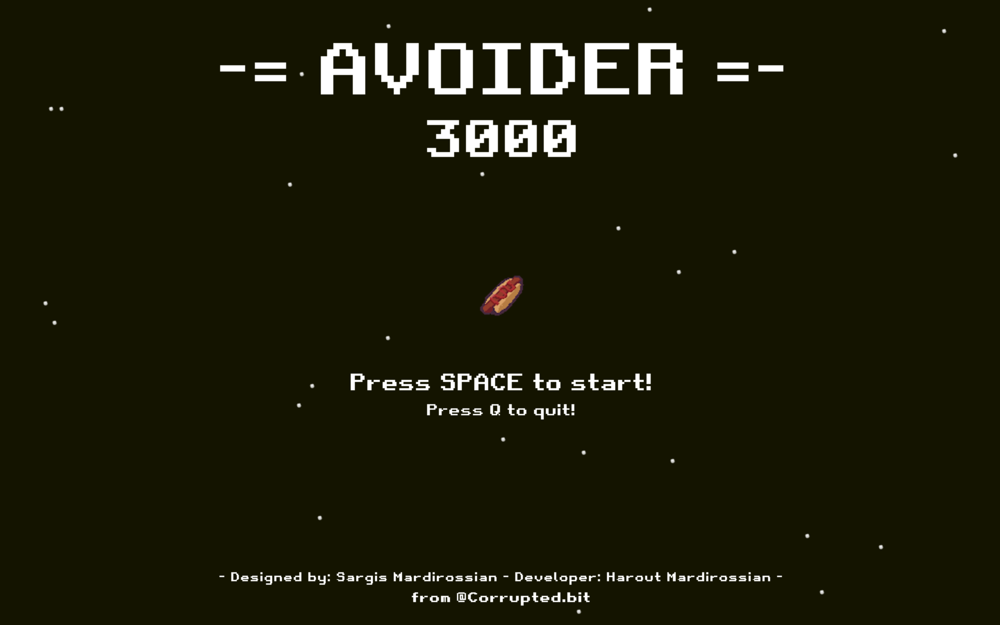

# -= AVOIDER 3000 =-

## Avoid. AVOID? AVOIDER made to avoid. That's it!

What is **Avoider 3000**? This is a retro-endless-arcade game based on space shooters from 80s arcade machines.
I really love old games and always enjoyed playing them over and over. So I thought, why not, let's start small and move on to bigger and greater. With my brother **(the world's best artist by the way)**, we started thinking about what we want to create. 
Looking through the pages of the book, we came across "Space Invaders". The iconic game of the time and a space shoot-em-up. I started recreating that game but during the development, I changed my mind.
"Space Invaders" is a static game and doesn't have much action happening, you don't have many obstacles to avoid. **Avoid. AVOID? AVOIDER made to avoid. That's it!**

## Game writen using Python using **PyGame** Module

### Developer dependencies

install pygame:
```
~ pip install pygame
```

### How to run
in terminal:
```
~ python main.py
```

Game developed using **Python 3.7.2** and tested on **Python 3.9**

## Screenshots

### Main Menu


### Gameplay Screen

#
### The game is still in development. 
I'm adding new things to it (not always, I'm too lazy to do it), doing the code clean up, and improving functionality, and I guess I will release it someday, but for now I still working on an idea of implementing cool mechanics into the game, because it is still a boring piece of code.
